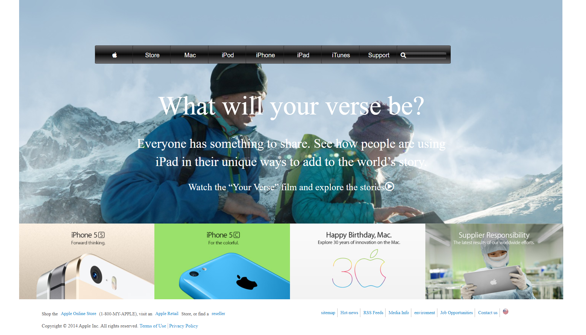

# HTML & CSS: Copy of old version of apple.com

> This project consists of building a webpage using images as a background and adding gradients to elements. 

## Built With

- HTML
- CSS

## Live Demo

[NYT-Clone](https://rawcdn.githack.com/LamiaSristy/nytimes-clone/7d2a29e01ee9a7318f301de67f95a5e568b3ee5b/index.html)

## Authors

👤 **Lamia Sristy**

- Github: [@LamiaSristy](https://github.com/LamiaSristy)

👤 **Author2**

- Github: [
- Linkedin: [@AkintoyeOlamide](http://github.com/AkintoyeOlamide)

## Show your support

Give a ⭐️ if you like this project!

## 📝 License

This project is [MIT](lic.url) licensed.
